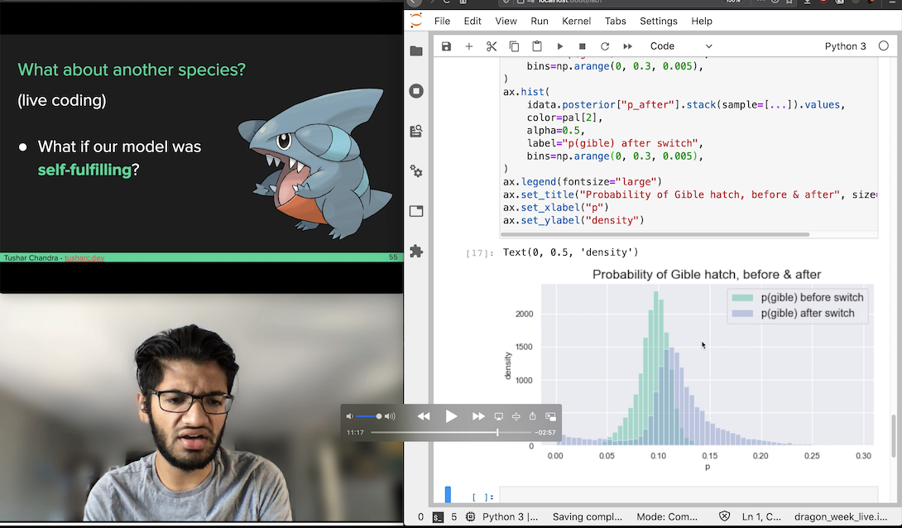

# Learning Bayesian Statistics with Pokemon GO

This repo contains the materials for my [PyMCon](pymc-devs.github.io/pymcon/) talk, *Learning Bayesian Statistics with Pokemon GO*.

The notebooks are:

 * `1_rayquaza.ipynb` is our first model: suppose we got 2 shinies in 44 encounters; what do we think the shiny rate is?
 * `2_silph.ipynb` is the second: given a sequence of events, how does our understanding of the shiny rate change over time?
 * `3_dragon_week.ipynb` is the third: did the chance of hatching a Deino change in the middle of the Dragon Week event?

There are two CSV files: `rates.csv` for the second model and `dragon_week.csv` for the third.

The `environment.yml` file can reproduce my conda environment in which I ran all of the code.
